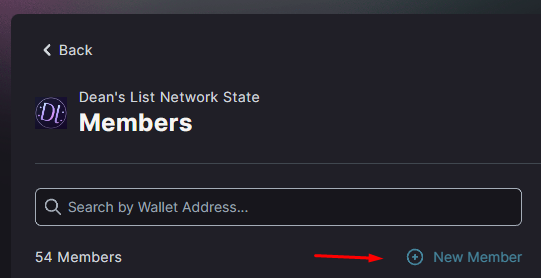
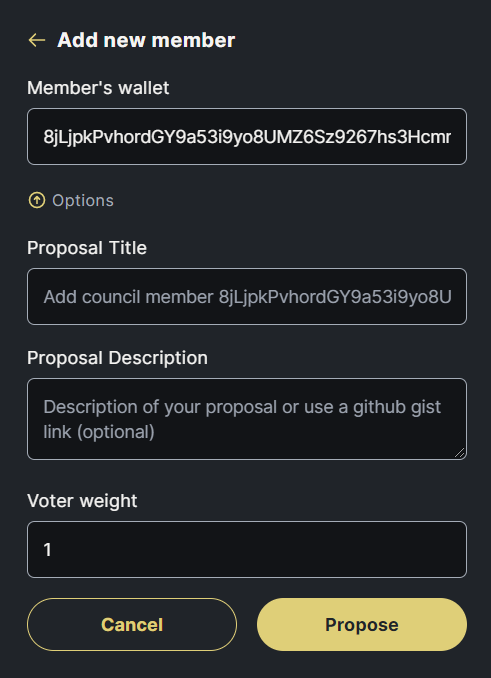

# 🕶 Adding Council Members to a DAO

In order to add a member to your **DAO**, follow the steps detailed below:

<figure><figcaption></figcaption></figure>

1. Click on the **\[+]** button in the members panel of your **DAO**.

<figure><figcaption></figcaption></figure>

2. Specify the new member's **wallet address** in the form that appears and press the **\[Propose]** button to create a proposal to add the new member.

<figure><figcaption></figcaption></figure>


All the other options of the proposal are **automatically filled out** and you don't have to specify them unless you want to override the default values.&#x20;


3. Proposal details:
   * **Proposal Title**: This is the title the other members of your DAO will see when they vote on the proposal.
   * **Proposal Description**: The description of the proposal.
   * **Voter Weight**: If the member is added the voter weight defines how much voting power the member will have. Voter weight of 1 means the new member would have 1 vote in the DAO. The voter weight can be changed in the future by creating additional proposals.

<figure><figcaption></figcaption></figure>

3. After proposing and voting yourself, you have to wait for other members of the **DAO** to vote to add the member. Depending on how the **DAO** is set up a different percentage of members will have to accept the proposal before the new member can be added.

<figure><figcaption></figcaption></figure>

3. When enough members approve the proposal and the **approval quorum** is reached, it is automatically passed without waiting the full voting time (**3 days by default**).
4. Finally, after the proposal is approved by the **DAO** members, in the "**Instructions**" section of the proposal click on the **\[Execute]** button to mint the membership token(s) to the new member.

<figure><figcaption></figcaption></figure>
