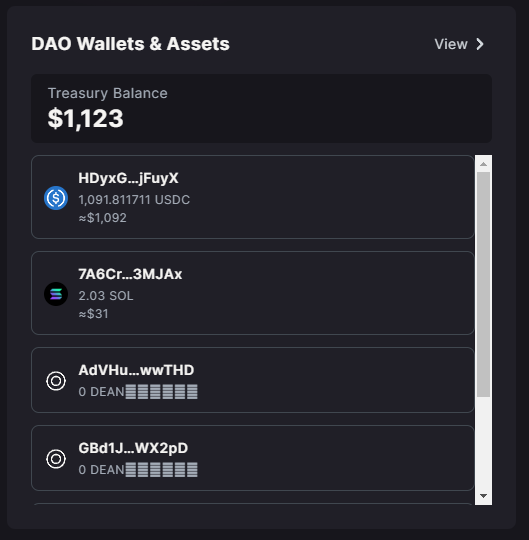
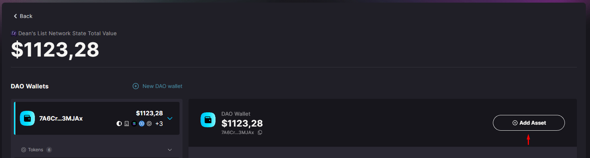
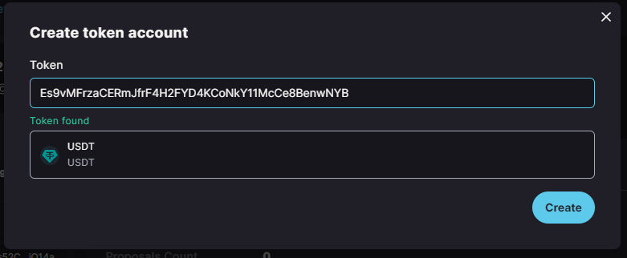
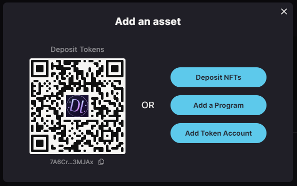

# 💰 Treasury Accounts

A **treasury account** is a shared wallet that holds assets owned by a **DAO**. Each **DAO** can have any number of treasury accounts holding different assets. Anybody can deposit tokens into treasury accounts but only the **DAO** members can approve withdrawals through treasury transfer proposals​.

<figure><figcaption></figcaption></figure>

## Creating Treasury Account

To create a treasury account, select the plus button in the right corner of the Treasury View​.

<figure><figcaption></figcaption></figure>

## Token Treasury

If you want your treasury account to hold tokens (e.g., **USDC**), you have to provide the token address (aka **mint address**) of the token you need​.

1. **Common token addresses:**

* **USDC:** `EPjFWdd5AufqSSqeM2qN1xzybapC8G4wEGGkZwyTDt1v`
* **USDT:** `Es9vMFrzaCERmJfrF4H2FYD4KCoNkY11McCe8BenwNYB`

<figure><figcaption></figcaption></figure>

<figure><figcaption></figcaption></figure>


Realms will automatically say if the token address is **correct** or **not**.


## NFT treasury

If you want your treasury account to hold NFTs, then choose the **`NFT Treasury`** option​.

<figure><figcaption></figcaption></figure>

## Treasury Governance Settings

* **Min community tokens to create a proposal**: The minimal amount of the **DAO** community governance tokens a member of the DAO has to own to be allowed to propose transfers from the treasury.&#x20;


For Multisig **DAOs** without the community governance token, this value is irrelevant and it's defaulted to an arbitrary number of `1,000,000.`


* **Min instruction hold up time (days)**: The minimal number of days before you can transfer funds from the treasury after a vote on the transfer proposal is approved​.&#x20;


The delay for treasuries is usually set to `0` to allow transfers of the assets immediately after they are approved​.​


* **Max voting time (days)**: The maximum number of days the **DAO** can vote on the treasury proposals. If consensus is not reached by the end of the voting time, the proposal is defeated​.
* **Yes vote threshold (%)**: The Yes vote threshold defines the number of Approve votes required to approve a transfer from a treasury account. For example, if there are 10 members in the **DAO** and the Yes threshold is set to **60%**, then at least **6 members** must approve any transfers from the treasury​.

After providing all the details, press the `Create` button and the new treasury account will be created and accessible from the main page of your **DAO**​.
