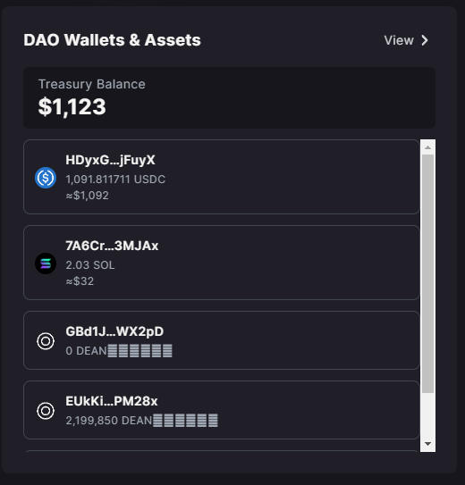
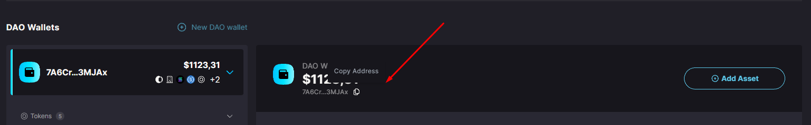
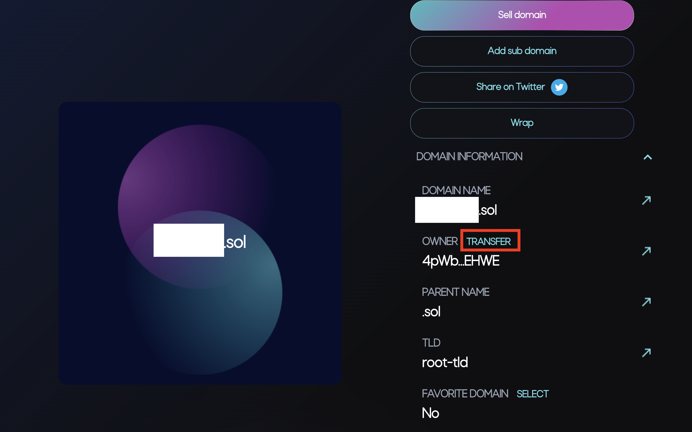

# 💰 Treasury Domain Name

The **Treasury domain** name is a feature in the Solana Governance UI that allows a treasury account to have a **`.sol`** address, such as **`mytreasury.sol`**, through [**Bonfida**](https://naming.bonfida.org/). \
\
Anybody can send **`.sol`** domains to the treasury account. A **Bonfida** domain points to the current owner of said domain. For more information on solana domains, read [**Bonfida's documentation**](https://docs.bonfida.org/collection/an-introduction-to-the-solana-name-service).


A domain name must be owned _by the **treasury**, not the **governance** itself_ to **function**. \
\
Do not transfer **ownership** of a domain to the **governance's pubkey**.


1. **Purchasing a .sol domain name:**

To purchase a **`.sol`** domain name, you need to navigate to [**Bondifa's Solana Name Service**](https://naming.bonfida.org/) and follow the process detailed there.

2. **Set up treasury address:**

Before proceeding, ensure that your governance (e.g., **DAO**) has a SOL [**Treasury Accounts**](treasury-account.md). If you don't have one set up yet, you should do so before continuing.

<figure><figcaption></figcaption></figure>

Once you have a treasury account, copy the **deposit address of the treasury**. This will be the address to which you'll transfer the **`.sol`** domain name

<figure><figcaption></figcaption></figure>

3. **Transfer domain to treasury:**

After setting up a treasury address, the next step is to transfer your domain to the **treasury's address** (the one you just copied). \
\
To do this, go to [**your domains**](https://naming.bonfida.org/#/profile?view=domains) on **Bonfida**, and select the domain you'd like to **transfer**. Under the "**Domain information**", "**Owner**" section, click the "**Transfer**" button. Paste in your **treasury address** and hit transfer.

<figure><figcaption></figcaption></figure>

Once the transaction is processed, your domain has been transferred to the **treasury** and is now pointing to your **treasury's address**. You can test this by sending a small amount of SOL to this **`.sol`** domain name and see that it arrives directly into your treasury.


It is currently only possible to transfer out a domain name from the treasury to a different address using a proposal with a custom instruction.

