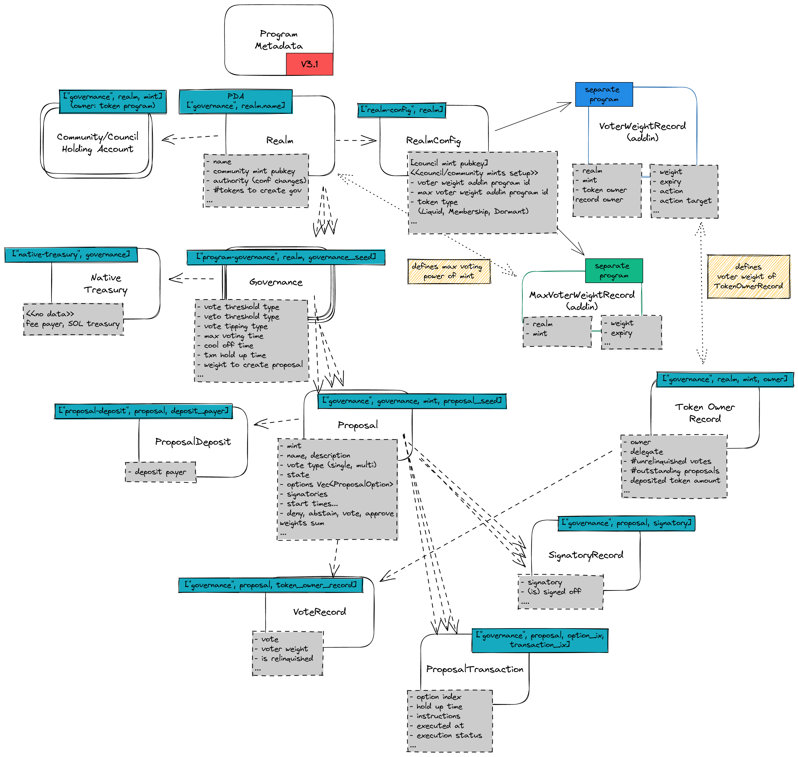
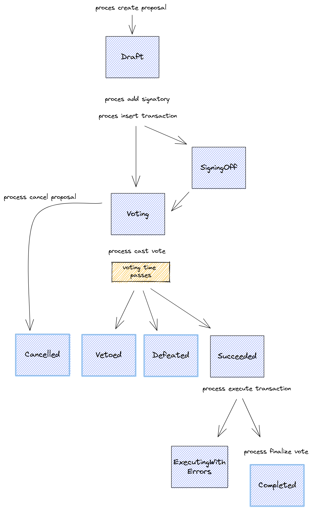

# 🤿 SPL Governance

## SPL Governance

The SPL Governance is [a Solana blockchain program](https://github.com/solana-labs/solana-program-library/tree/master/governance) developed as part of the [Solana Program Library](https://spl.solana.com/), meaning the program is developed by guys from Solana Labs. The program's purpose is to provide a blockchain-based tool to manage [Decentralized Autonomous Organization (DAO)](https://docs.marinade.finance/marinade-dao).

The SPL Governance is designed in a generic manner to cover a good number of use cases for DAO management. The cornerstone of functionality covers creating proposals containing blockchain instructions that DAO members may vote upon, and on successful voting, the instructions may be executed. A simplistic use case could be to use the system to create a multisig control over the distribution of DAO funds. \
\
A heavier use runs smooth DAO management through created instructions that can be voted on by the community and/or council, which consists of minting tokens, transferring funds from the DAO treasury, upgrading the code of programs belonging to the DAO, and administering the managed programs.

## Where to find, how to get?


This article refers to **SPL Governance** in version **3.1.0** [**released in December 2022**](https://github.com/solana-labs/solana-program-library/releases/tag/governance-v3.1.0).


The program of [**SPL Governance**](https://github.com/solana-labs/solana-program-library/blob/governance-v3.1.0/governance/README.md) is part of the Solana Program Library at https://github.com/solana-labs/solana-program-library/tree/governance-v3.1.0/governance. A shared instance of the program is deployed at **`GovER5Lthms3bLBqWub97yVrMmEogzX7xNjdXpPPCVZw`**. \
\
While [**it's recommended**](https://discord.com/channels/910194960941338677/945282322318655528/1079728429697597462) for **DAO** in many cases to do [**own deployment**](https://github.com/solana-labs/solana-program-library/tree/governance-v3.1.0/governance#1-dao-owned-instance) of the program. That way, you can take the code from the repository and publish it to the network with a unique address. An advantage of such an approach is that the **DAO** can manage when the program is upgraded, a disadvantage could be that the **DAO** has to maintain the program and its upgrades itself.


For your own deployment, use **`Anchor`** verifiable build.


**SPL Governance** provides a UI to do DAO management easily. That's available at _https://app.realms.today/realms_ (to work on **devnet**, add [**`?cluster=devnet`**](https://app.realms.today/realms?cluster=devnet) into address bar). \
\
The source code of the UI is available at the repository: \
\- **https://github.com/solana-labs/governance-ui**


When the own deployment of the program is done, the new address should be configured in the UI, into a list of known instances. That mostly means [**creating a PR**](https://github.com/solana-labs/governance-ui/pull/1534) with the configuration.


To integrate the **SPL Governance** into your own application, you can use the **Typescript SDK** under the Oyster repository:\
\- **https://github.com/solana-labs/oyster/tree/main/packages/governance-sdk**

## Other resources

A good complementary resource to this article could be the official [**README of the governance program**](https://github.com/solana-labs/solana-program-library/blob/master/governance/README.md) at GitHub.

Then a nice technical description of the SPL Governance system can be found at sec3 article [**Solana DAO Governance (Part 1): understanding SPL Governance Workflow**](https://medium.com/coinmonks/solana-dao-governance-part-1-understanding-spl-governance-3ccf6d6912bc). \
\
A nice governance UI tutorial is available at [**PsyFi documentation page**](https://docs.psyoptions.io/psy-token-and-dao/governance-tutorials/governance-overview-and-walkthrough).

## Terms and Glossary

The terms used within the SPL Governance system are a bit ambiguous in some places, so let's pin some of them to clarify their meaning and not miss you in the rest of the text.

### DAO vs. Realm

The term **`realm`** is used at multiple places within the texts and documentation of the **SPL Gov system**. At some perspectives, it can be considered the equivalent of **DAO**, in cases, a **DAO** may consist of several **`realms`**. Let's elaborate.

From a technical perspective, the **`Realm`** is the top level wrapper of configuration setup for **DAO**. In this context, the [**`Realm`**](https://github.com/solana-labs/solana-program-library/blob/governance-v3.1.0/governance/program/src/state/realm.rs) is the top level data structure of the program that all other data structures refer to.

If the **DAO**, as the organization itself, requires specific configuration for their voting in such a case, such a decentralized organization could create multiple `Realms`, all belonging to one **DAO**. But such a configuration is rather exceptional. It's usual that a **DAO** is managed within one **`Realm`**. For that, it's usual to consider the terms **`dao`** and `a`` `**`realm`** equivalent in the **SPL Governance system**. It's the reason why the **`governance-ui`** uses both terms interchangeably.

### Governance vs. DAO Wallet

The term governance is ubiquitous. You can find it in the name of the library; the purpose of the program is to **govern** the **DAO**. Thus, eyes looking into the repository will reach the [**governance**](https://github.com/solana-labs/solana-program-library/blob/governance-v3.1.0/governance/program/src/state/governance.rs) term naturally and quite promptly. From a code perspective, it's a data structure that defines the content of the Solana account. It's strictly bound to one realm (see above). Governance consists of a set of configuration parameters for voting over proposals. \
\
On top, the governance determines a strictly unique [**DAO wallet containing native SOL**](https://github.com/solana-labs/solana-program-library/blob/governance-v3.1.0/governance/program/src/state/native\_treasury.rs). It's a Solana account that holds native SOL tokens owned by `System Program, created as a PDA seeded by the governance account address. The SPL Governance program names the DAO Wallet with the term`_**`native treasury`**_. Any transaction executed on behalf of a particular realm falls under its governance. which may use the **DAO** wallet as a fee payer.

The UI differentiates between governance and the DAO wallet, but it's important to know that these terms are synonymous.


It is highly recommended to utilize the address of [**the DAO wallet**](https://github.com/solana-labs/solana-program-library/blob/governance-v3.1.0/governance/NOTES.md#dao-wallet) (i.e., **`governance native treasury address`**) as the authority for managing any assets under the **`Realm`**. This includes matters such as a mint authority, a token owner authority, or a contract custom admin authority with permission to make configuration changes. While using the governance address for these purposes is possible, it is not considered a best practice.


### Proposal

It's a submission represented by a poll where voters place their pro or con attitudes. When the poll successfully passes, the proposal is considered successful, and if the submission contains a transaction, it can be executed to seal the resolution of the voting.

The resolution of voting depends on the number of votes gained, while thresholds of success are defined in configuration by the creator of the voting. These are parameters placed within the governance as every proposal belongs under one governance.

A voter is represented by a wallet containing tokens that identify the voter's voting power of the voter.

## SPL Governance account structure

The Governance account structure is documented [**in the repository**](https://github.com/solana-labs/solana-program-library/blob/governance-v3.1.0/governance#program-accounts). But let's take a look at the account hierarchy in more detail. We will start with a picture of all available accounts, and then have a description of them.

<figure><figcaption></figcaption></figure>

The top-level account (representing a **DAO**, as explained above) is [**the `Realm` account**](https://github.com/solana-labs/solana-program-library/blob/governance-v3.1.0/governance/program/src/state/realm.rs#L124). The address of the realm account is [**calculated as a PDA address**](https://github.com/solana-labs/solana-program-library/blob/governance-v3.1.0/governance/program/src/state/realm.rs#L125) identified by its name. There cannot be two realms with the same name, the name cannot be changed while a display name is used for example, in the Governance UI [**can be modified**](https://discord.com/channels/910194960941338677/964818745786789898/1093478043382722580).

The realm is defined by two groups of voting population: **`council`** and **`community`**. Each voting population configures its **`mint`** while the field of **`community_mint`** can be defined only at the time of creation and cannot be changed later (different community mints are available when creating a new realm or applying plugin functionality like [**Voter Stake Registry (VSR)**](https://github.com/blockworks-foundation/voter-stake-registry).\
\
Members of the population have the ability to create a proposal with or without instructions for execution upon successful voting. The creator of the proposal establishes the voting population. For example, when a proposal is created for the council to vote on, only council members are eligible to vote. However, members of the other population, in this case, the community, may veto the proposal.

In addition, the realm encompasses other configuration parameters, including the rule for when a new governance instance can be created. A new governance instance can be created when the instruction is signed by the Realm's **`authority`** address, by a council member who owns at least one token, or by a community member who possesses enough voting power as specified in the Realm account.

The configuration of the realm is held in a separate Solana account known as the [**`RealmConfigAccount`**](https://github.com/solana-labs/solana-program-library/blob/governance-v3.1.0/governance/program/src/state/realm\_config.rs#L80). The **`Realm`** structure includes a field called **`realm_config`** that stores a public key pointing to a distinct account called **`RealmConfigAccount`**. This account split is the result of Solana's inability to support account size changes in the past. The **`RealmConfigAccount`** specifies the type of token (liquid, membership, dormant/disabled) used for a specific group of voters or plugin usage for voter weight calculation (e.g., VSR plugin).

The realm groups a few or multiple [**`Governance`**](https://github.com/solana-labs/solana-program-library/blob/governance-v3.1.0/governance/program/src/state/governance.rs#L80) accounts. Governance is a basic configuration unit that defines limits for creating proposals, voting time, thresholds, and if voting may be finished before voting time elapses (known as `vote tipping`), if vetoing proposals is permitted, and ultimately sign the transactions to be executed using governance and native treasury (DAO Wallet) keys.


As with any other account mentioned in this listing, the governance account is a PDA account that's seeded with the realm account address and a **`governance_seed`**. Previously, **`governance_seed`** was a public key of governed program, but this concept is obsolete now. The **`governance seed`** should be considered an arbitrary public key that's used only to seed the governance account address. The `Governance` may manage whatever asset (token, program, etc.), and it's not limited to a single governed program address.



Similar to all other accounts listed here, the governance account is a PDA account. It is seeded with the realm address and a **`governance_seed`**. Previously, the **`governance_seed`** was a public key of the governed program, but this concept is now considered obsolete. The **`governance_seed`** should be treated as an arbitrary public key used solely to seed the governance account address. The `Governance` has the ability to manage any asset, whether it be a token, program, or other, and is not limited to a single governed program address.


The next part of the account structure hierarchy is the [**`Proposal`**](https://github.com/solana-labs/solana-program-library/blob/governance-v3.1.0/governance/program/src/state/proposal.rs#L105) The proposal is created within one particular governance. A proposal is bound to a single mint (**`governing_token_mint`**) that defines the population (council or community) that may vote for it. The proposal consists of several options (determined by a string label) that the voting population can choose from. There is an optionally defined instructions for particular options that are executed when the option passes successfully. After creation, the proposal goes through a lifecycle defined by [**several states**](https://github.com/solana-labs/solana-program-library/blob/governance-v3.1.0/governance/program/src/state/enums.rs#L101). The lifecycle state designates permitted operations over the proposal — only at certain states can the proposal be cancelled, voted for, transaction execution run, etc.

Then the **`Proposal`** may be, but cannot be, linked with some instructions that will be executed when the proposal passes successfully through voting. The list of instructions is defined in one or multiple [**`ProposalTransaction`**](https://github.com/solana-labs/solana-program-library/blob/governance-v3.1.0/governance/program/src/state/proposal\_transaction.rs) accounts. The account consists of a list of public keys that are expected to be provided at the time of **`Execution`**, the transaction call data, and then [**metadata and configuration**](https://github.com/solana-labs/solana-program-library/blob/governance-v3.1.0/governance/program/src/state/proposal\_transaction.rs#L86).

### Different types of governances

When one checks the **SPL Governance** program in **version 3.1.0**, one may notice that different types of governance can be created. Those are the [**mint, program and token**](https://github.com/solana-labs/solana-program-library/blob/governance-v3.1.0/governance/program/src/state/governance.rs#L126) governance account types. All of those are [**considered deprecated**](https://github.com/solana-labs/solana-program-library/blob/governance-v3.1.0/governance/NOTES.md#asset-specific-governances-are-deprecated) but as of now heavily used within Governance UI (because of some [**technical limitations**](https://discord.com/channels/910194960941338677/910566058740568094/1098293000028831824)).

## Lifecycle of a proposal

<figure><figcaption></figcaption></figure>

As said before, the proposal goes through a lifecycle defined by several states. Let's take a look at them in more detail.

## Draft

A new proposal is created in **`Draft`** state. The proposal consists of a set of options (each of which is determined by a string label and an index in the array where it's stored). When in **`Draft`** state, the creator of the proposal may add multiple signatories to the proposal with [**`AddSignatory` instruction**](https://github.com/solana-labs/solana-program-library/blob/governance-v3.1.0/governance/program/src/processor/mod.rs#L162). The proposal moves to **`Voting`** state only when all signatories sign the "drafted" proposal (we consider the "drafted" proposal one in **`Draft`** or **`SigningOff`** state). That way, one may ensure that the proposal won't leave the "drafted" state until all defined signatories confirm that the proposal is prepared to be voted on (i.e., until not ready to take votes).

Calling the **`AddSignatory`** instruction is not required, and for moving the proposal to **`Voting`** state, at least the signatory of the creator is required. When a signatory has been appointed by calling the **`AddSignatory`** instruction, the signature of the creator is not demanded for the proposal to move to the **`Voting`** state. When a first signatory signs the proposal by calling the **`SignOffProposal`** instruction the proposal moves to the **`SigningOff`** state and no other signature can be added. When all signatories (or the creator herself) sign the proposal, it moves to the **`Voting`** state immediately at the call of **`SignOffProposal`** instruction.

Until the proposal is in the **`Voting`** state, one can call the  **`InsertTransaction`** instruction to bound instructions to an option of the proposal. The option is defined by an index within the array structure, and that index is passed to **`InsertTransaction`** instruction. The call may be repeated with the same option to place multiple instructions. As well, the instructions can be grouped into an array of instructions that are executed atomically. The inserted [**list of instructions**](https://github.com/solana-labs/oyster/blob/040b7c89f757846f64c2436dbb58ecc4db8c5837/packages/governance-sdk/src/governance/withInsertTransaction.ts#L14) is stored in [**a transaction account**](https://github.com/solana-labs/solana-program-library/blob/governance-v3.1.0/governance/program/src/state/proposal\_transaction.rs#L102) and at the time of execution, the [**`ProcessExecuteTransaction`**](https://github.com/solana-labs/solana-program-library/blob/governance-v3.1.0/governance/program/src/processor/process\_execute\_transaction.rs) takes the transaction account and executes the instructions stored in it. The address of the transaction account is calculated from [**the proposal public key, index of the option and index of the instruction**](https://github.com/solana-labs/oyster/blob/040b7c89f757846f64c2436dbb58ecc4db8c5837/packages/governance-sdk/src/governance/accounts.ts#L1241).


On creating a proposal, there is a deposit, [**a certain amount of SOLs**](https://github.com/solana-labs/solana-program-library/blob/governance-v3.1.0/governance/program/src/processor/process\_create\_proposal.rs#L188) to custody of the Governance system. The amount increases based on the currently active proposals. The deposited amount [**can be refunded**](https://github.com/solana-labs/solana-program-library/blob/governance-v3.1.0/governance/program/src/processor/process\_refund\_proposal\_deposit.rs) when the voting on the proposal is finished. The reason for that is to prevent spamming the system with proposals that are not going to be voted on. It's the benefit of UI that such maintenance operations are handled automatically.


## Voting

When all signatories consider the proposal ready to be signed. When all transactions are in place and every signatory has been acknowledged by call of [**`SignOffProposal`**](https://github.com/solana-labs/solana-program-library/blob/governance-v3.1.0/governance/program/src/processor/mod.rs#L168) instruction, then with the last signature, the proposal is moved to the **`Voting`** state. In this state, the proposal is ready to take votes. The voting population of the **`council`** or **`community`** may vote on the proposal. They can vote **`Yes`** for the proposal or cast `deny` (`No`) votes against it. The voting is done by calling [**`CastVote` instruction**](https://github.com/solana-labs/solana-program-library/blob/governance-v3.1.0/governance/program/src/processor/mod.rs#L171). Voting time is defined by [**`voting_base_time`**](https://github.com/solana-labs/solana-program-library/blob/governance-v3.1.0/governance/program/src/state/governance.rs#L43) governance attribute and can be prolonged by setting-up [**`voting_cool_off_time`**](https://github.com/solana-labs/solana-program-library/blob/governance-v3.1.0/governance/program/src/state/governance.rs#L65). At **`voting_cool_off_time`** period, the user may only cast negative votes (**`deny`** and **`vetoes`**) or relinquish his vote. The voting may be finished before the voting time elapses when [**`vote tipping`**](https://github.com/solana-labs/solana-program-library/blob/governance-v3.1.0/governance/program/src/state/governance.rs#L45) is enabled.

The voter may change his mind and cast another vote. That has to be done by first calling the [**`RelinquishVote`**](https://github.com/solana-labs/solana-program-library/blob/governance-v3.1.0/governance/program/src/processor/mod.rs#L175) that removes the voting power from the option, and then a new vote can be cast.

When the voting time elapses and the proposal is not tipped to be finished sooner, one needs to call [**`FinalizeVote`**](https://github.com/solana-labs/solana-program-library/blob/governance-v3.1.0/governance/program/src/processor/mod.rs#L173) instruction for the proposal being moved to **`Succeeded`** (a non-final) or **`Defeated`** (a final) state. The **`FinalizeVote`** instruction checks the number (more precisely the weight) of **`Yes`** votes and the number of `deny` votes at all options of the proposal and considers the [**type of the proposal**](https://github.com/solana-labs/solana-program-library/blob/governance-v3.1.0/governance/program/src/state/enums.rs#L144) and then decides the result.

The workflow for **`Veto`** votes is a bit different. The proposal is moved to the final **`Vetoed`** state when the veto threshold is met. This is checked at every **`CastVote`** call, regardless of whether **`vote tipping`** is enabled or not.

During the time the proposal is in the **`Draft`** state or under **`Voting`** the proposal may be cancelled. When it happens, the proposal is moved to a final **`Cancelled`** state. Only the owner of the proposal is permitted to call the instruction [**`CancelProposal`**](https://github.com/solana-labs/solana-program-library/blob/governance-v3.1.0/governance/program/src/processor/mod.rs#L177). The term owner means a token owner record account (see below) that was inserted into the proposal account on its creation.

The wallet may vote **`Yes`** (meaning adding a positive vote for the proposal to pass), or may vote **`No`** (meaning voting to deny the proposal) or may vote to **`Abstain`**. The [**proposal option**](https://github.com/solana-labs/solana-program-library/blob/master/governance/program/src/state/proposal.rs#L54) successfully passes when the option gains at least the weight of votes equal to [**`community/council_vote_threshold`**](https://github.com/solana-labs/solana-program-library/blob/master/governance/program/src/state/governance.rs#L32) configured as a parameter in **`Governance`**, and the weight of **`Yes`** votes is higher than the weight of deny **`No`** votes. The same weight of the positive (**`Yes`**) and weight of the deny (**`No`**) votes is a tie, and it is resolved as **`Defeated`**. The proposal passes when at least one option has succeeded.

## Finalization

When the proposal ends in the **`Succeeded`** state, the instructions bound to the proposal's option may be executed. Besides the proposal's final state, each option marks its final state separately. Only those options that were marked as [**`Succeeded`**](https://github.com/solana-labs/solana-program-library/blob/governance-v3.1.0/governance/program/src/state/proposal.rs#L41) may execute attached instructions with the call of [**`ExecuteTransaction`**](https://github.com/solana-labs/solana-program-library/blob/governance-v3.1.0/governance/program/src/processor/mod.rs#L196).

The governance may be configured with [**`min_transaction_hold_up_time`**](https://github.com/solana-labs/solana-program-library/blob/governance-v3.1.0/governance/program/src/state/governance.rs#L37), which defines the minimum time that the proposal has to wait after the proposal voting ends before the instruction can be started to be executed. Every transaction holds the configuration parameter [**`hold_up_time`**](https://github.com/solana-labs/solana-program-library/blob/governance-v3.1.0/governance/program/src/state/proposal\_transaction.rs#L99) that cannot be lower than the minimum configured at governance (but it can be higher than that number) and is defined by the creator of the proposal.

When all instructions are executed, the proposal is moved to the final [**`Completed`**](https://github.com/solana-labs/solana-program-library/blob/governance-v3.1.0/governance/program/src/state/enums.rs#L121) state.

There is one more eventuality where the instructions from the proposal fail to be executed. That could be caused by wrongly composed instructions (e.g., wrong accounts passed to the instruction) or the state of the blockchain changed since the proposal was created and the constraints for the instruction executions cannot be met anymore. In that case, the proposal may be marked as [**`ExecutingWithErrors`**](https://github.com/solana-labs/solana-program-library/blob/governance-v3.1.0/governance/program/src/state/enums.rs#L121) by calling the appropriate instruction (called by the proposal creator).

## Survey type proposals

There is one special "type" of proposal that goes through the lifecycle slightly differently than usual proposals. I used the word "type" in quotes because it is not a real type of proposal but just a proposal with specific attributes. When you create a proposal without any instructions attached to it and deny voting, [**is not permitted**](https://github.com/solana-labs/solana-program-library/blob/governance-v3.1.0/governance/program/src/processor/process\_create\_proposal.rs#L40), it is considered a survey-type proposal.

The survey-type proposal has no effect on the state of the blockchain and is used to collect the opinion of the community.

The survey-type proposal does not progress to the **`Succeeded`** state and immediately moves to the `Completed` state when the voting ends.

## Voting and Locking Tokens

We have discussed the data structures and workflow of **SPL Governance** but have not yet touched on the topic of voting. Who can vote on proposals and how is the voting power calculated?

The voter must be the owner of the tokens. A **`realm`** is created with the definitions of **`community`** and **`council`** mints. Ownership of the token gives the right to vote on proposals. Voting power is calculated as the ratio of the locked number of tokens owned by the voter and the maximum voter weight of tokens for the mint. The maximum voter weight could be considered the total supply of tokens for the mint. That's strictly true for **`council`** token. For community tokens, one can configure the **`realm`** attribute [**community\_mint\_max\_voter\_weight\_source**](https://github.com/solana-labs/solana-program-library/blob/governance-v3.1.0/governance/program/src/state/realm.rs#L43) where beside the total supply of tokens [**the max voter weight**](https://github.com/solana-labs/solana-program-library/blob/governance-v3.1.0/governance/program/src/state/proposal.rs#L519) could be defined as an absolute number or as taking only a fraction of the total supply. The other option to configure this is to use the plugin system (see below).

Beside that, the **`realm`** configures [**how the token is considered**](https://github.com/solana-labs/solana-program-library/blob/governance-v3.1.0/governance/program/src/state/realm\_config.rs#L21). If the token type is **`membership`** then the token is controlled by the **`realm`**. The token cannot be transferred to another wallet. When the token type is **`liquid`** then the token can be freely transferred and traded, the mint authority is controlled either by **`realm`** or by any other entity. The **`dormant`** token type says that part of the voting population is disabled in the **`realm`**.

For the voter to employ their voting power, they must lock the tokens to the **`realm`**. This is done by a [**deposit call**](https://github.com/solana-labs/solana-program-library/blob/governance-v3.1.0/governance/program/src/processor/process\_deposit\_governing\_tokens.rs). The tokens are locked until any active proposal on which the voter voted exists. For the owner to withdraw the funds, he has to wait until the voting period ends or when he relinquishes his votes.

The SPL Governance creates an account [**`token owner record`**](https://github.com/solana-labs/solana-program-library/blob/governance-v3.1.0/governance/program/src/state/token\_owner\_record.rs#L33) for each voter (more precisely, for every wallet). This record keeps track of how many tokens were locked, as well as the number of active proposals that the voter has voted for and the number of unrelinquished proposals to determine whether a withdrawal is possible.

The number of locked tokens under the **`token owner record`** determines the voting power of the owner of the record. The owner may delegate this voting power to another wallet by setting it up [**the delegate field**](https://github.com/solana-labs/solana-program-library/blob/governance-v3.1.0/governance/program/src/state/token\_owner\_record.rs#L80) in the **`token owner record`**. Only one delegate can be defined per token owner record.

## Vote Record

[**Casting a vote**](https://github.com/solana-labs/solana-program-library/blob/governance-v3.1.0/governance/program/src/processor/process\_cast\_vote.rs#L31) means to add voting weight to the proposal option. The voter can choose to vote for or against the proposal or to abstain from voting. The type of vote is defined by the [**`Vote` enum**](https://github.com/solana-labs/solana-program-library/blob/governance-v3.1.0/governance/program/src/state/vote\_record.rs#L48) and passed as an argument in the [**cast vote instruction**](https://github.com/solana-labs/solana-program-library/blob/governance-v3.1.0/governance/program/src/processor/process\_cast\_vote.rs#LL34C14-L34C14).

When a voter casts their vote, information about this action is written to two places in the Solana blockchain. First, the proposal account is updated with the summary of the [**weight of votes**](https://github.com/solana-labs/solana-program-library/blob/governance-v3.1.0/governance/program/src/state/proposal.rs#L60) for each option, which is used during proposal finalization (**`vote records`** are not used for this purpose).

Second, a [**`vote record`**](https://github.com/solana-labs/solana-program-library/blob/governance-v3.1.0/governance/program/src/state/vote\_record.rs) account is created. This record gathers information such as the casted voting weight, type of vote, etc. The existence of the record attests that a vote has been cast from a particular **`token owner record`** for a particular proposal. The vote record is used to prevent double voting and for historical purposes.

## Plugin System

The SPL Governance Program is designed to be extensible. In version 3.1.0, there are two available extension points: [**`voter weight` and `max voter weight`**](https://github.com/solana-labs/solana-program-library/blob/governance-v3.1.0/governance/addin-api/README.md) addins.

The configuration of the realm defines that there is an add-in to be used for any calculation of [**the voting power (voter weight) and max voter weight**](https://github.com/solana-labs/solana-program-library/blob/governance-v3.1.0/governance/program/src/state/realm\_config.rs#L64). This way, the voting power cannot depend solely on the number of locked tokens at the mint but mostly anything can be used for the calculation.
